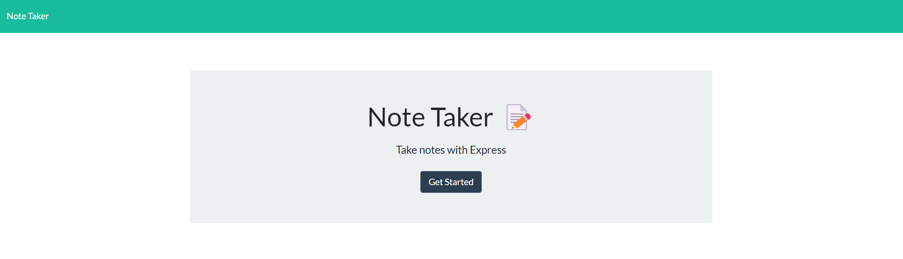
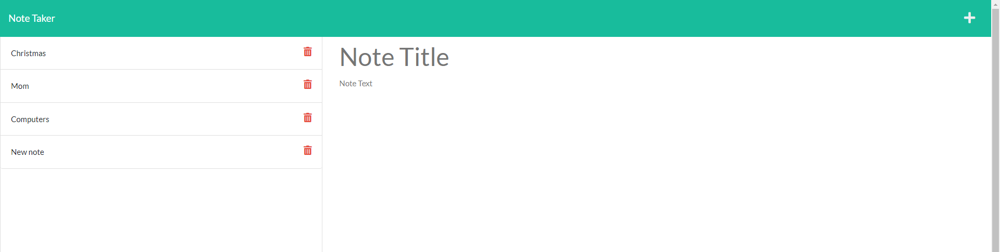

# Express.js Note Taker

  

## Description
  
  The application keeps track of notes and allows you to recall, create, and delete notes. It is hosted on a local server programmed with Express.js and makes calls to a local database file to handle the notes.
  
  
## Table of Contents
  
- [Express.js Note Taker](#expressjs-note-taker)
  - [Description](#description)
  - [Table of Contents](#table-of-contents)
  - [Installation](#installation)
  - [Usage](#usage)
  - [Credits](#credits)
  - [License](#license)
  - [How to Contribute](#how-to-contribute)
  - [Tests](#tests)
  - [Questions](#questions)
  
  
## Installation
  
  Clone this repo. Once opened in a code editor, open the terminal and run the command "npm i" to initiate the NPM packages needed for this application. 
  
  
## Usage
  
  To use this application, click on the Heroku link at the bottom of this README file. Once the page has loaded, click the "Get Started" button. From there you can create a new note, load previous notes, or delete existing notes. 

  

  
      
  
## Credits
  
  EdX Boot Camps provided starter code on the index.js file.
  
  
## License
  
  This software is licensed under the MIT license.
  
  ---
  
  
## How to Contribute
  
  N/A
  
  
## Tests
  
  N/A
  
  
## Questions
  
  Please forward any and all questions to benjaminmichaelday@gmail.com
  
  GitHub username: benmday

Deployed Heroku application: https://challenge-week-11-note-taker.herokuapp.com/notes

GitHub repo: https://github.com/benmday/challenge-week-11-note-taker